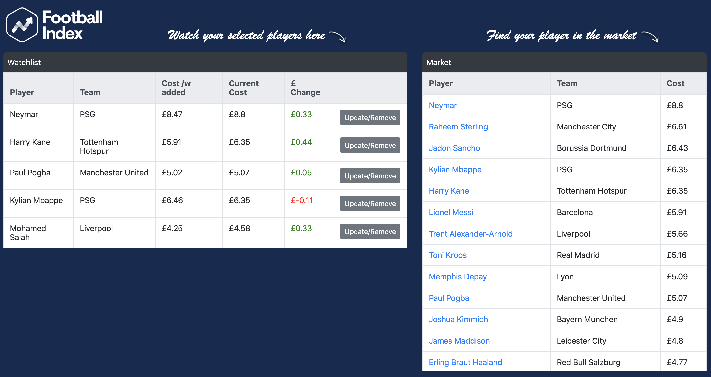
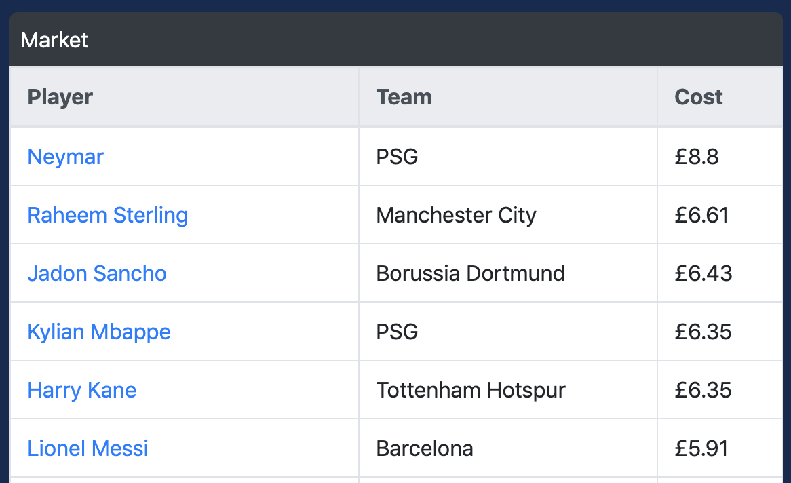
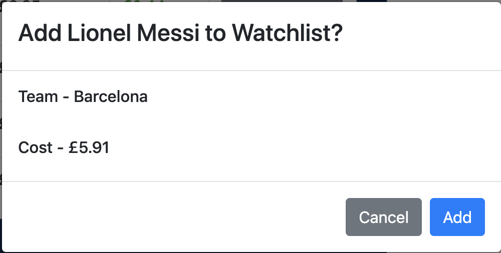
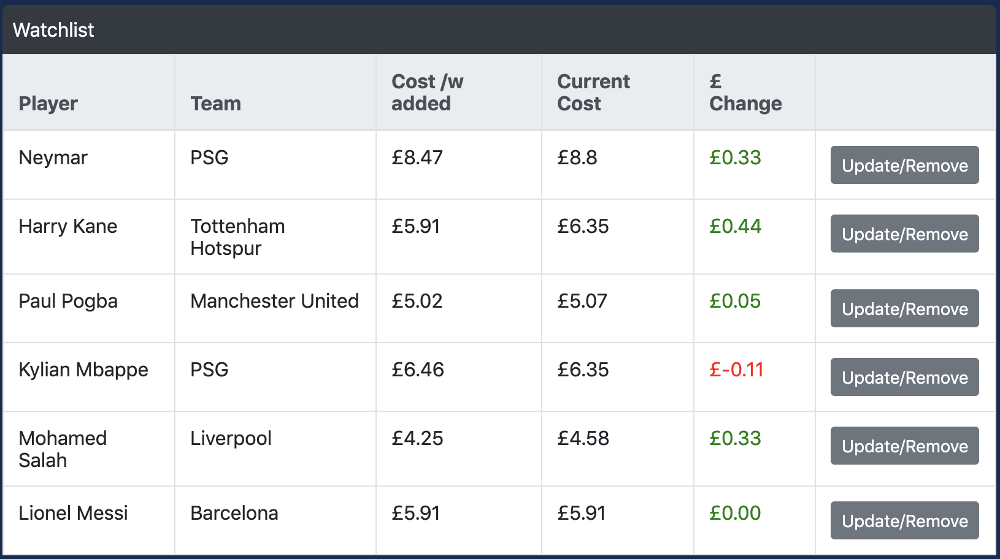
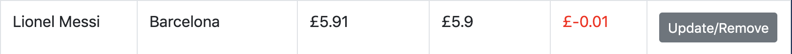
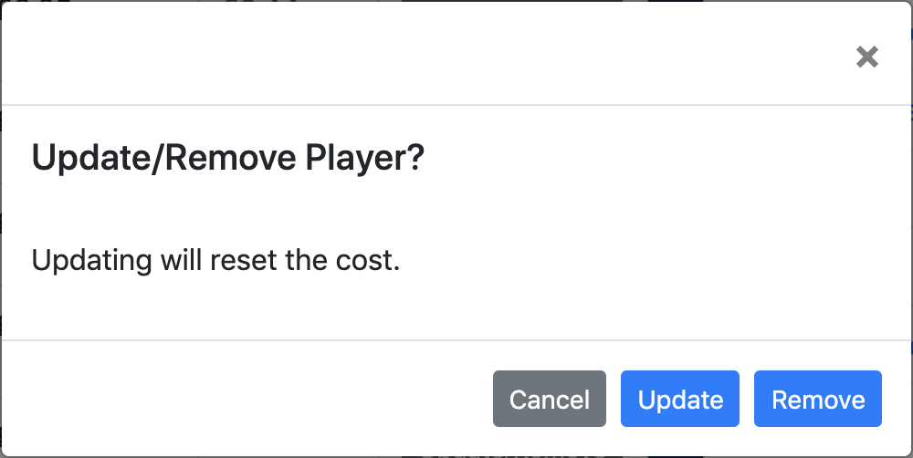

# Football Index Watchlist

Football Index Watchlist allows you to track the movement of football player prices. It is built with a Javascript frontend and a Rails API backend.

## Description

The Rails API is designed to simulate the share price movement of football players on the football stock market www.footballindex.co.uk. A Javascript frontend communicates with the API to display current share prices, and allows the user to add a player, along with the current share price, to a watchlist and follow the players progress.

The homepage displays two tables, the table on the right is the Player market, showing the top 50 players in order of price.  The table on the left is the Watchlist, populated with players that are currently being watched.

Select a Player in the market by clicking on the players name. In this example we are choosing to watch Lionel Messi.

A modal will appear asking to confirm the choice of player.

Lionel Messi now appears on the bottom of the watchlist, along with a breakdown of his current price, price when added, and profit/loss.

Refreshing the page updates the market price of the player. We can see now Lionel Messi has dropped in price.

To update the Players price, click on the update/remove button next to the Player in the watchlist. A modal will appear with the option to update the price to the current market price, or remove the player from the watchlist.

## Installation

Clone the repository:

[https://github.com/rayvaldez/football-index-watchlist](https://github.com/rayvaldez/football-index-watchlist)

And then execute:

    $ rails s

## Usage

Click on a player you wish to follow and he will simply be added to your watchlist. You can also remove the player by clicking the delete button.

## Contributing

Bug reports and pull requests are welcome on GitHub at https://github.com/rayvaldez/football-index-watchlist. This project is intended to be a safe, welcoming space for collaboration, and contributors are expected to adhere to the [Contributor Covenant](http://contributor-covenant.org) code of conduct.

## License

The repository is available as open source under the terms of the [MIT License](https://opensource.org/licenses/MIT).

## Code of Conduct

Everyone interacting in the 'football-index-watchlist' project’s codebases, issue trackers, chat rooms and mailing lists is expected to follow the [code of conduct](https://github.com/rayvaldez/football-index-watchlist/CODE_OF_CONDUCT.md).
